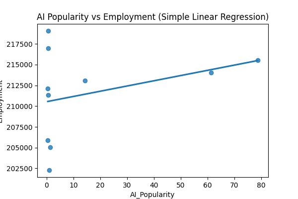
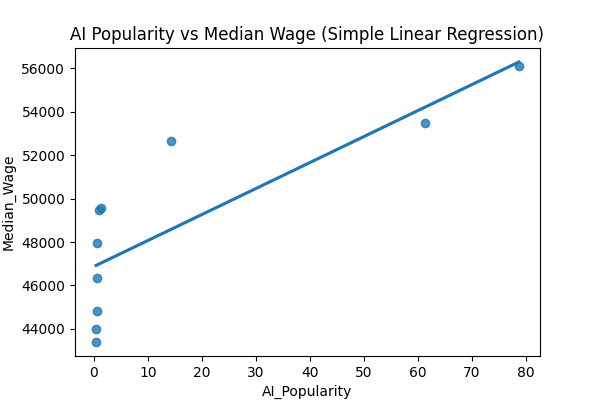
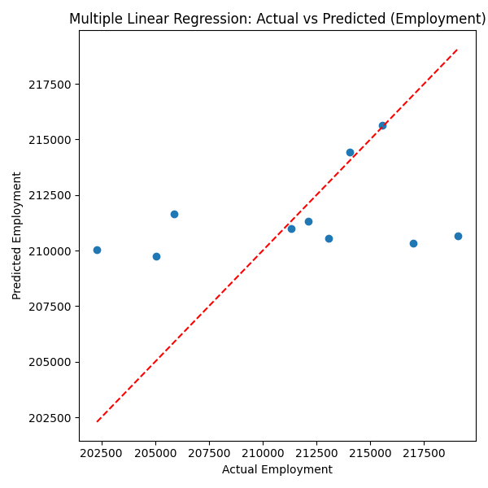

# The Influence of AI Growth on the Employment and Wage Trends of Graphic Designers  
## First step of the project
## Project Overview 
This project investigates the relationship between the rise of AI technologies (such as **Midjourney**, **DALL·E**, **Canva AI**, and **ChatGPT**) and the employment trends of graphic designers.  
By analyzing data from the past decade (2015–2024), this project aims to uncover whether the growing popularity of AI-driven creative tools correlates with a decline in employment opportunities or job demand for graphic designers.

### Key Research Questions
- How strongly does the rise of AI tools (measured by search trends or adoption metrics) correlate with employment or job postings for graphic designers?
- Is there a visible impact of AI popularity on designer salaries or wage growth?
- Can data-driven evidence support the hypothesis that AI automation is transforming the creative job market?

---

## Motivation
Over the last few years, tools like **Midjourney**, **DALL·E**, **Canva AI**, and **ChatGPT** have changed the way digital art and design are created.  
Many designers fear that AI-generated content may be replacing human creativity, while others see it as a way to increase efficiency and creativity.

This project aims to analyze real data to understand whether these fears are justified.  
By studying employment and AI popularity trends together, I want to explore if the creative industry is being disrupted—or just evolving—in response to AI innovations.

---

## Objectives
- Find out if there is a negative/positive correlation between AI tool adoption and graphic designer employment.  
- Identify how salaries, job postings, and industry growth have changed over the last 10 years.  
- Create visualizations that clearly show the trends between AI growth and design jobs.  
- Discuss whether AI has replaced or reshaped creative work and what the data suggests about the future.

## Second Step of the Project
## Data Sources

### 1. Employment and Wage Data (Primary Dataset)  
Source: U.S. Bureau of Labor Statistics (BLS)  
URL: https://www.bls.gov/oes/current/oes271024.htm  
Description:  
Yearly state-level statistics for the occupation "Graphic Designers" (27-1024), including:  
- Total employment  
- Median annual wages  
- Industry-level data  

Files used:  
Graphic_Designer_data/

### 2. AI Popularity Data (Enrichment Dataset)  
Source: Google Trends  
Keywords: AI Art, DALL·E, Midjourney, Canva AI, ChatGPT  

Files used:  
AI_data/

## Step 2: Data Collection, Cleaning, and EDA

### Cleaning Methods  
- Normalized inconsistent numeric formats  
- Selected graphic designer rows (OCC_CODE = 27-1024)  
- Extracted year information  
- Computed national total employment  
- Calculated national median wage  
- Averaged monthly Google Trends interest into yearly scores  
- Merged datasets on "Year"  

### Final Merged DataFrame Columns  
Year, Employment, Median_Wage, AI_Popularity, Emp_Change_%, Wage_Change_%, AI_Change_%

## EDA Visualizations

## Hypothesis Tests

### AI Popularity vs Employment  
Conclusion: No significant statistical evidence that AI popularity affects employment levels.

### AI Popularity vs Wage  
Conclusion: Strong statistical evidence that AI popularity is positively associated with wage increases.

## Key Findings  
1. No significant impact of AI growth on employment levels.  
2. Strong positive relationship between AI popularity and median wages.  
3. All metrics show stable or increasing trends.  
4. AI may enhance designer productivity and value.

# Third Step of the Project
## Step 3: Machine Learning Methods

In this step, machine learning methods are applied to further analyze the relationship between AI popularity and the employment and wage trends of graphic designers.  
The objective of this step is to move beyond exploratory analysis and hypothesis testing by using predictive and structural models.

Due to the small size of the dataset (annual data from 2015–2024), interpretable and low-complexity machine learning methods are preferred.

---

## Machine Learning Methods Used

### 1. Simple Linear Regression

Simple linear regression is used to model the direct relationship between AI popularity and each target variable independently.

Models:
- Employment = β₀ + β₁ · AI_Popularity  
- Median_Wage = β₀ + β₁ · AI_Popularity  

Purpose:
- Measure the isolated effect of AI popularity  
- Quantify the strength and direction of the relationship  
- Evaluate explanatory power using R²  

Findings:
- AI popularity shows weak explanatory power for employment  
- AI popularity shows strong explanatory power for median wages  

---

### 2. Multiple Linear Regression

Multiple linear regression extends the analysis by including time as an additional explanatory variable.

Models:
- Employment = β₀ + β₁ · AI_Popularity + β₂ · Year  
- Median_Wage = β₀ + β₁ · AI_Popularity + β₂ · Year  

Purpose:
- Control for long-term time trends  
- Separate the effect of AI popularity from general temporal growth  
- Improve interpretability compared to simple regression  

Findings:
- Wage models achieve higher R² values than employment models  
- Year is a strong contributor to wage growth  
- Employment remains weakly explained, consistent with Step 2 results  

---

### 3. Principal Component Analysis (PCA)

Principal Component Analysis (PCA) is applied as an unsupervised learning method to analyze the overall structure of the dataset.

Input features:
- Employment  
- Median_Wage  
- AI_Popularity  

Purpose:
- Reduce dimensionality  
- Identify dominant sources of variance  
- Understand how variables move together over time  

Findings:
- The first principal component is dominated by AI popularity and median wage  
- Employment contributes less to the main variance direction  
- This supports earlier findings that AI growth aligns more strongly with wage dynamics than with employment levels  

---

## Machine Learning Visualizations

  
  
  
  
  

---

## Step 3 Key Findings

- Simple and multiple linear regression confirm that AI popularity is strongly associated with wage growth but not with employment decline.  
- Including time as a feature improves model performance, especially for wage prediction.  
- PCA reveals that AI popularity and wages follow a shared underlying trend, while employment behaves differently.  
- Overall, AI appears to reshape economic value in the profession rather than reduce employment opportunities.  

---

## Files Added in Step 3

- `final_dataset.csv` — cleaned dataset used for machine learning  
- `ml_models_dataset.ipynb` — regression and PCA analysis notebook  

---

## Repository Structure

DSA210_Project/  
│  
├── AI_data/  # contatins csv dataset regarding AI trends  
├── Graphic_Designer_data/ # contains xlsx datasets regarding Wages and employment  
├── plots/  
├── 1_collect_data.ipynb  
├── step3_ml_model.ipynb
├── README.md  

## Requirements  
`pandas, numpy, matplotlib, seaborn, scipy, openpyxl, scikit-learn`
