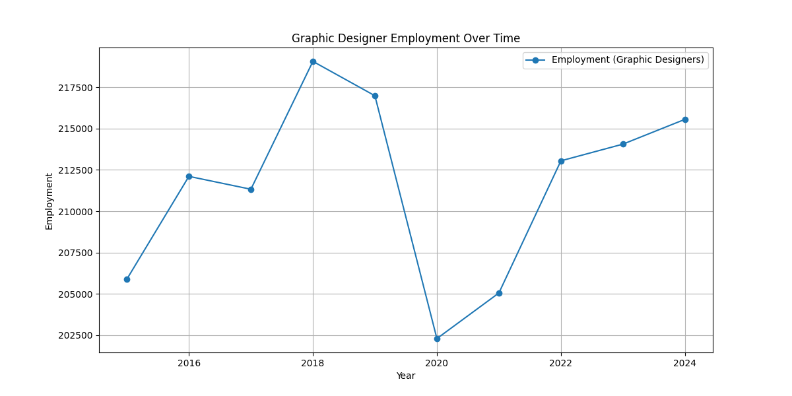
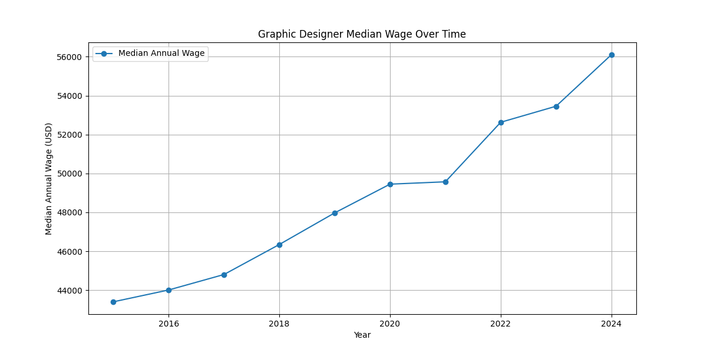
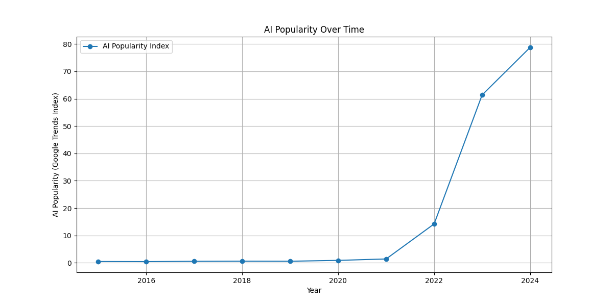
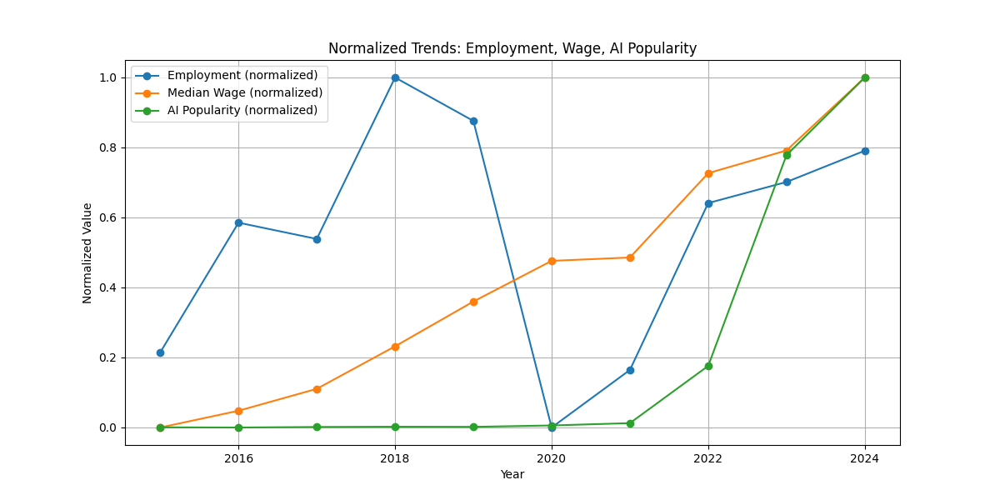
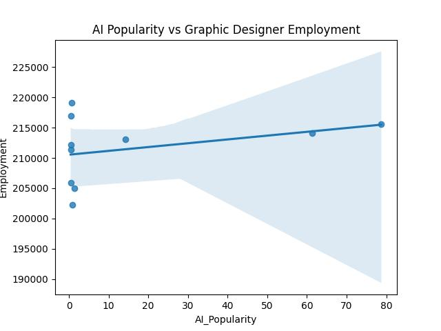
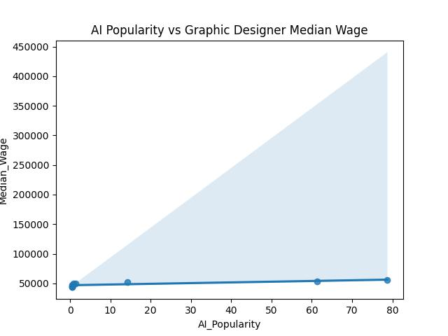

# The Influence of AI Growth on the Employment and Wage Trends of Graphic Designers  
DSA210 – Introduction to Data Science  
Fall 2025–2026 Term Project (Step 2 Submission)  
Javidan Gasimli (javidan.gasimli@sabanciuniv.edu) (34580)

## Project Overview  
This project investigates how the rise of AI-driven creative tools (such as Midjourney, DALL·E, Canva AI, and ChatGPT) relates to employment and wage trends for graphic designers in the United States.  
Using data from 2015–2024, the analysis examines whether increasing AI popularity corresponds to changes in graphic designer employment levels and wage growth.

This project follows the data science pipeline:
1. Data collection  
2. Data cleaning and preprocessing  
3. Exploratory data analysis (EDA)  
4. Hypothesis testing  

## Data Sources

### 1. Employment and Wage Data (Primary Dataset)  
Source: U.S. Bureau of Labor Statistics (BLS)  
URL: https://www.bls.gov/oes/current/oes271024.htm  
Description:  
Yearly state-level statistics for the occupation "Graphic Designers" (27-1024), including:  
- Total employment  
- Median annual wages  
- Industry-level data  

Files used:  
Graphic_Designer_data/

### 2. AI Popularity Data (Enrichment Dataset)  
Source: Google Trends  
Keywords: AI Art, DALL·E, Midjourney, Canva AI, ChatGPT  

Files used:  
AI_data/

## Step 2: Data Collection, Cleaning, and EDA

### Cleaning Methods  
- Normalized inconsistent numeric formats  
- Selected graphic designer rows (OCC_CODE = 27-1024)  
- Extracted year information  
- Computed national total employment  
- Calculated national median wage  
- Averaged monthly Google Trends interest into yearly scores  
- Merged datasets on "Year"  

### Final Merged DataFrame Columns  
Year, Employment, Median_Wage, AI_Popularity, Emp_Change_%, Wage_Change_%, AI_Change_%

## EDA Visualizations

## Hypothesis Tests

### AI Popularity vs Employment  
Conclusion: No significant statistical evidence that AI popularity affects employment levels.

### AI Popularity vs Wage  
Conclusion: Strong statistical evidence that AI popularity is positively associated with wage increases.

## Key Findings  
1. No significant impact of AI growth on employment levels.  
2. Strong positive relationship between AI popularity and median wages.  
3. All metrics show stable or increasing trends.  
4. AI may enhance designer productivity and value.

## Repository Structure

DSA210_Project/  
│  
├── AI_data/  # contatins csv dataset regarding AI trends  
├── Graphic_Designer_data/ # contains xlsx datasets regarding Wages and employment  
├── plots/  
├── collection_and_analysis.ipynb  
└── README.md  

## Requirements  
`pandas, numpy, matplotlib, seaborn, scipy, openpyxl`
